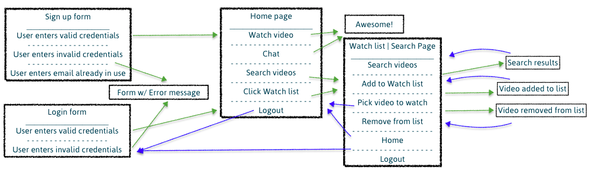

This project was bootstrapped with [Create React App](https://github.com/facebook/create-react-app).

## Popcorn | Thinkful Node-React-Redux Capstone
Watch videos along with friends, family, or sweethearts, near or far, and chat together.

Go to Popcorn server-side [Visit](https://github.com/azureowl/popcorn-node-capstone)

#### Screenshots

#### User Cases
Popcorn -- The app allows users to chat and watch a video together.

#### User Stories

* As a user, I should be able to login so that I may use Popcorn.
* As a user, I should be able to logout so that my account remains private.
* As a user, I should be able to register so that I can use the features.
* As a user, I should be able to chat with another user so that I can socialize while watching videos.
* As a user, I should be able to search YouTube videos so that I can watch what I want.
* As a user, I should be able to watch and chat at the same time with long-distance friends/family.
* As a user, I should be able to be in sync with the other user so that we can always watch at the same time.
* As a user, I should be able to add a video to my watch list (create) so that I can access them later.
* As a user, I should be able to get my list of videos (read) so that I can access what I want easily.
* As a user, I should be able to delete a video from my watch list (delete) so that I can keep my list up-to-date.

#### User Flow & Wireframe

#### Working Prototype
Demo credentials:

[Demo]()

#### Functionality

#### Technology
Frontend: HTML5 | CSS3 | JavaScript ES6 | jQuery  
Backend: Node.js | Express.js | Mocha | Chai | RESTful API Endpoints | MongoDB | Mongoose  
Security: bcrypt.js, JWT, Passport.js in progress

#### Responsive
App is responsive across most mobile, tablet, laptop, and desktop screen resolutions.

#### Development Roadmap
This is v1.0 of the app, but future enhancements may include:

* v2 - Implement YouTube user login through OAuth