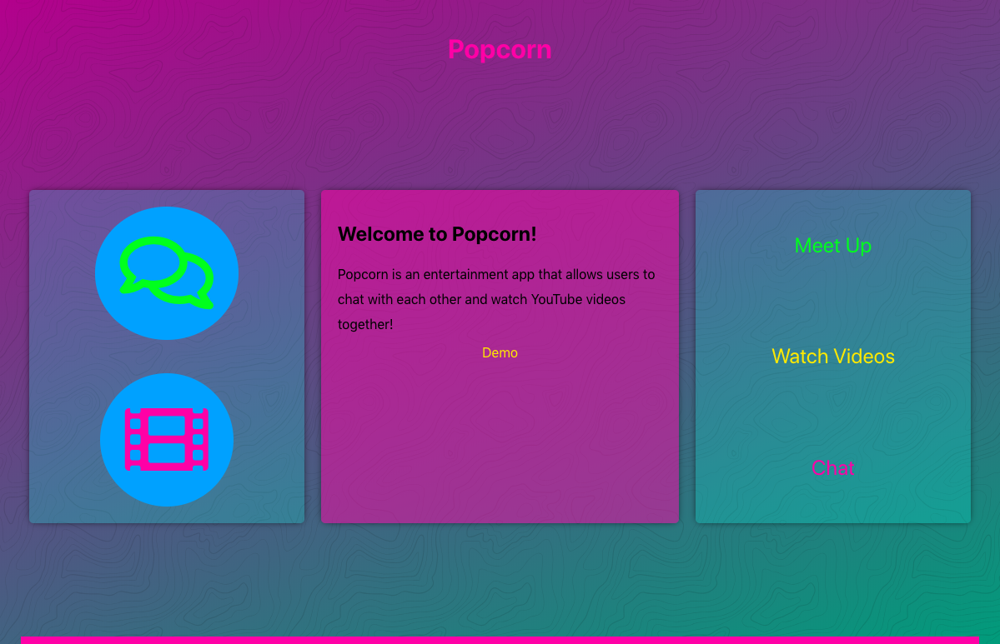
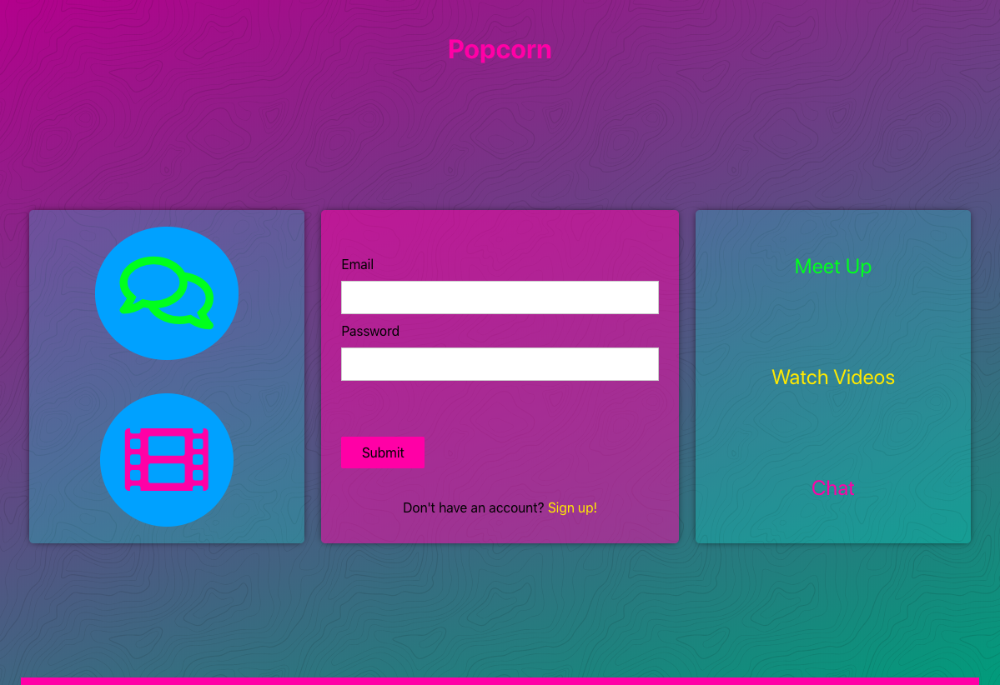
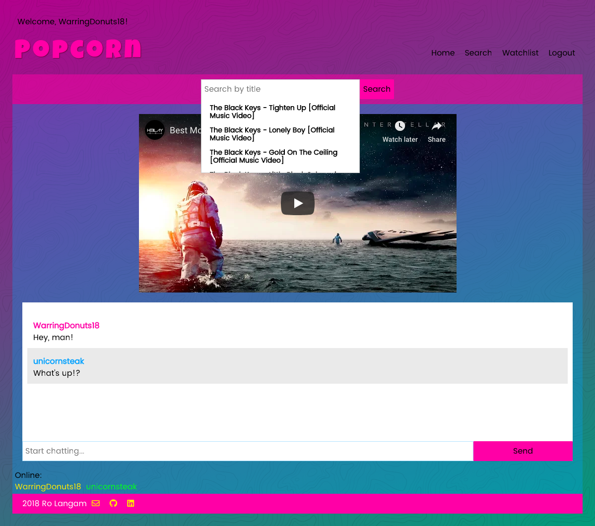
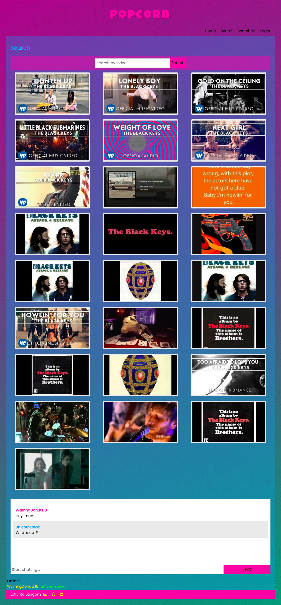
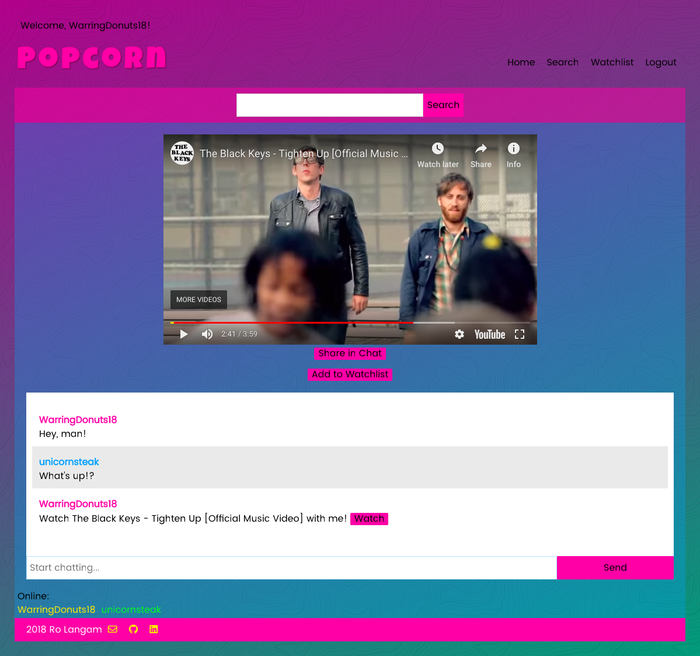
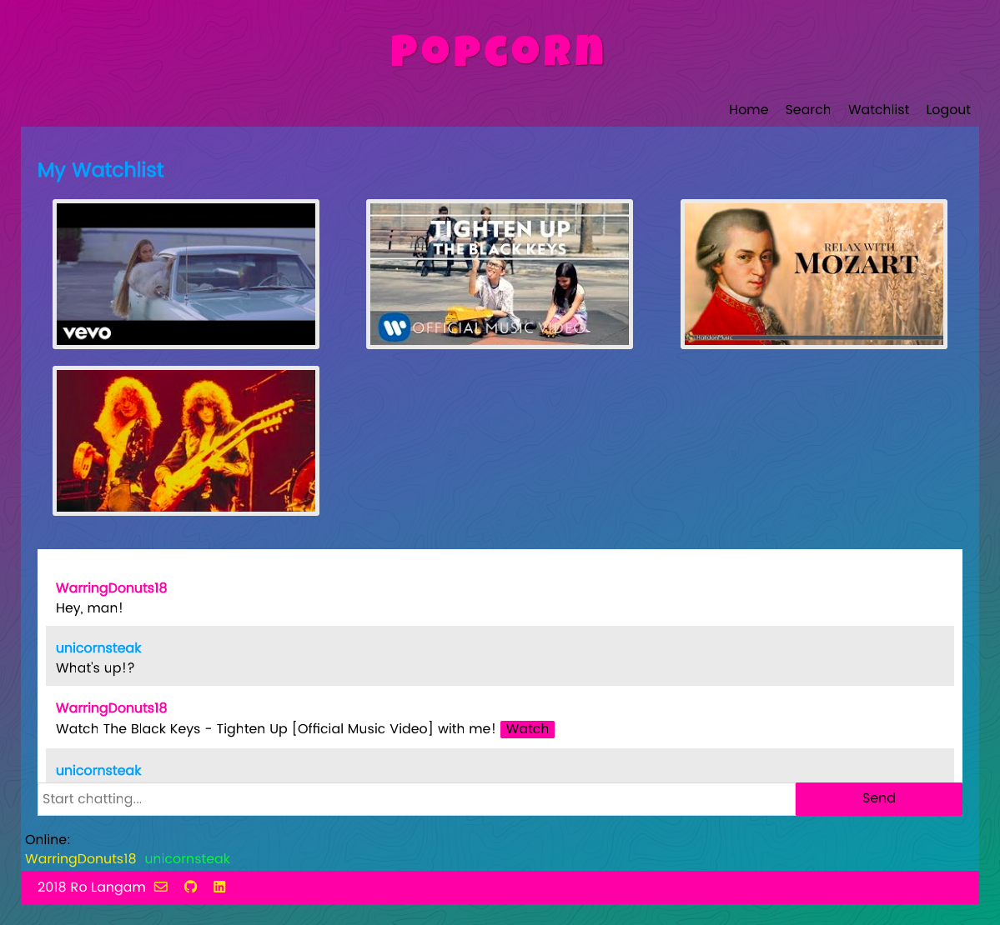

## Popcorn | Thinkful Node-React-Redux Capstone
Watch videos along with friends, family, or sweethearts, near or far, and chat together.

[For Popcorn server-side GitHub repo](https://github.com/azureowl/popcorn-node-capstone)

#### Screenshots

|  Landing  | Login   |  Search & Chat  |  
| -- | -- | -- |
|  |  |  

|  Search 2  |  Share  |  Watchlist  |
| -- | -- | -- |
|  |  | 

#### User Cases
Popcorn -- The app allows users to chat and watch a video together.

#### User Stories

* As a user, I should be able to login so that I may use Popcorn.
* As a user, I should be able to logout so that my account is protected.
* As a user, I should be able to register so that I can use the features.
* As a user, I should be able to chat with another user so that I can socialize.
* As a user, I should be able to search YouTube videos so that I can watch what I want.
* As a user, I should be able to watch and chat at the same time so that I can be entertained.
* As a user, I should be able to share with the other user so that I can watch what they're watching.
* As a user, I should be able to add a video to my watchlist (favorites) so that I can access them later.
* As a user, I should be able to get my list of favorites (read) so that I can access what I want easily.
* As a user, I should be able to delete a video from my favorites (delete) so that I can keep my list up-to-date.

#### User Flow & Wireframe

#### Working Prototype

[Demo](https://popcorn-capstone.herokuapp.com/)

#### Functionality

The app's functionality includes:

* Users have the ability to create an account that stores information unique to them
* User can read, add, and delete videos from their watchlist
* Users can chat with anyone logged in.
* Users can share videos with each other.

#### Technology
Frontend: React.js | Redux | CSS3 | JavaScript ES6  
Backend: Node.js | Express.js | Socket
Testing: Mocha | Chai  
External API: Youtube  
Database: MongoDB | Mongoose  
Security: bcrypt.js, JWT, Passport.js  

#### Responsive
App is responsive across most mobile, tablet, laptop, and desktop screen resolutions.

#### Development Roadmap
This is v1.0 of the app, but future enhancements may include:

##### v2
* Implement YouTube user login through OAuth
* Find friends
* Separate chat sessions